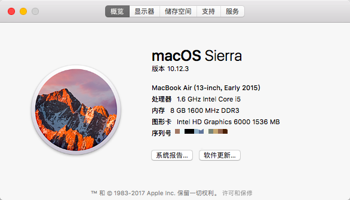
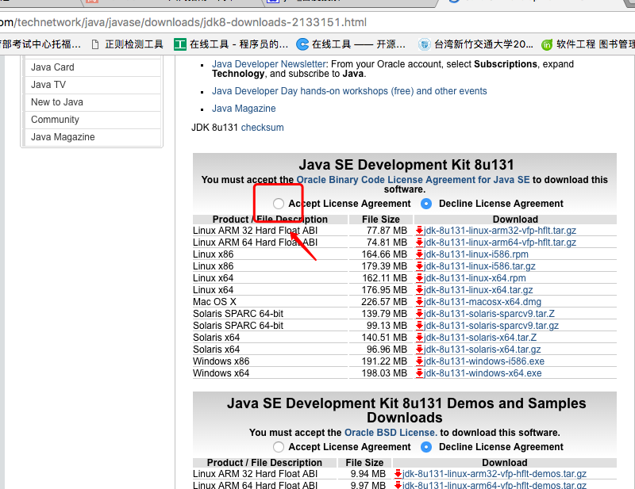
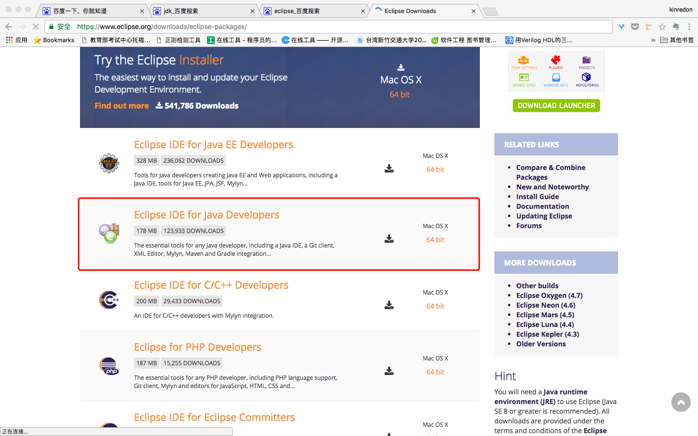

# Mac Os 配置java开发环境（Eclipse）

## 0. 环境说明
如下图：

## 1. 按照Jdk

[点击这里去下载](http://www.oracle.com/technetwork/java/javase/downloads/jdk8-downloads-2133151.html)

下载对应JDK即可，JDK集成了JVM、Jre和一些java开发工具包，所以不必再去下载JVM和Jre。

*判断是否安装成功课在终端输入* `java -version`查看是否成功，出现如下输出，则表示jdk安装成功。

## 2. 安装Eclipse

[Click here to download eclipse](https://www.eclipse.org/downloads/eclipse-packages/)

下载完成后按照mac电脑正常安装流程，将eclipse拖入Application安装即可

